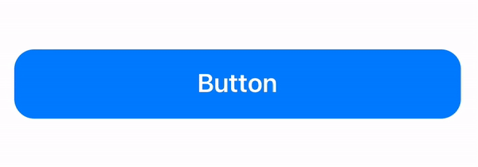
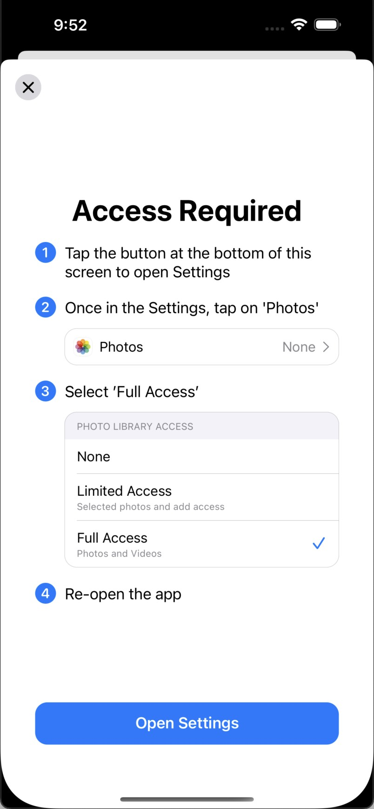
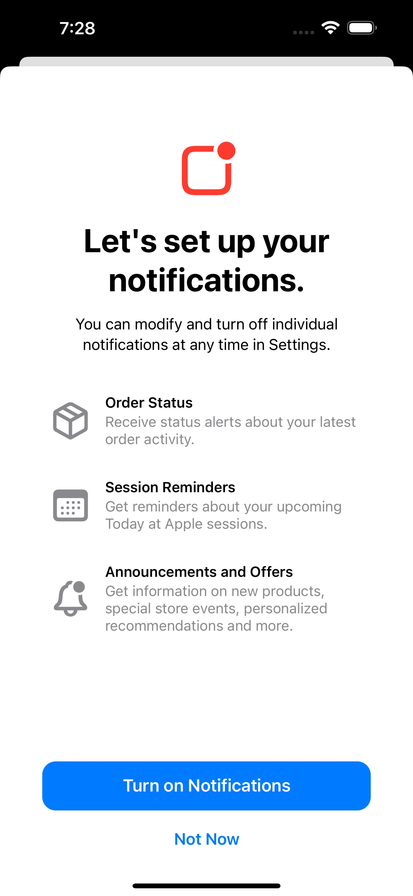
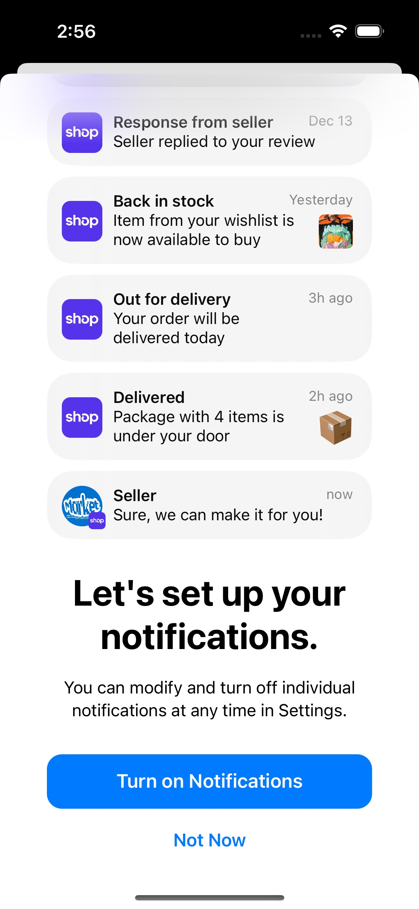
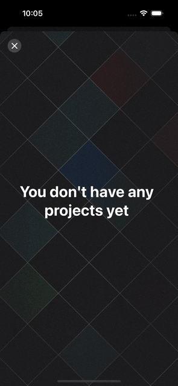
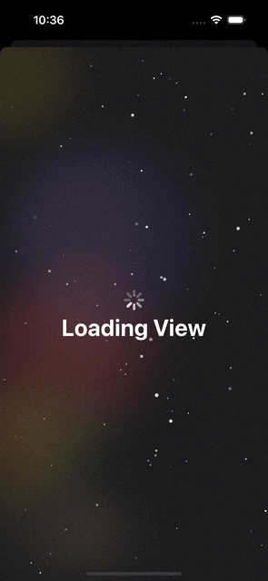
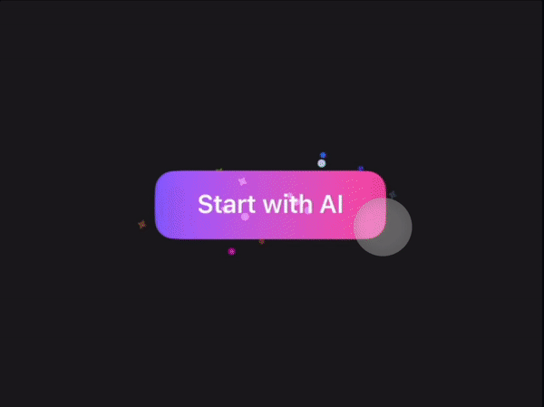

# UI Examples

In this repository, you'll find a collection of small, reusable code snippets that you can freely use and integrate into your own projects. These tiny UI treasures have been carefully crafted, saving you time and effort in your development journey.

## Nice Button

iOS system-style button with scaling down, haptic feedback, and smoothly rounded corners that change in the pressed state. Haptic effect when pressed.

- SwiftUI

## Gallery Access Restricted

User-friendly Apple-style screen that provides a step-by-step explanation of how to enable full access to the photo library after user has previously restricted it. The screen includes an 'Open Settings' button that guides users to the specific app's permission settings. Each step is accompanied by rich and fully localizable previews that replicate the appearance of the iOS Settings app. This ensures a pixel-perfect UI and system colors.

There are some delightful details: a variable background blur overlay beneath the 'Open Settings' button, consistently positioned at the bottom, and background blur applied to the small circle button, in line with Apple's design principles found in its native apps.

- SwiftUI
- Dark mode support 🌒
- iOS 16-17 different settings support
- Customizable & localizable 🇺🇸

## Ask for Notifications Permission

Apple-style implementation of a permission request screen for notifications. A user-friendly list displaying all types of notifications you can receive, along with icons (SF Symbols) and descriptions. This screen is scrollable, so you can add as many elements as you need. Selecting 'Turn on Notifications' will open a system alert requesting these permissions.

There is one delightful detail: a variable background blur overlay beneath the 'Turn on Notifications' button, consistently positioned at the bottom.

- SwiftUI
- Dark mode support 🌒
- Customizable & localizable 🇺🇸

## Ask for Notifications Permission with Examples

Pixel-perfect replication of iOS notification banners to make fully localizable screen asking for permissions. Screen displays all available notification types that application would like to send (animatable!), just like in real life, with all available scenarios. Add as much notifications as you need. Icons and pictures are fully customizable. Selecting 'Turn on Notifications' will open a system alert requesting these permissions.

- SwiftUI
- Dark mode support 🌒
- Customizable & localizable 🇺🇸
- Animated ✨

## Ask for Notifications Permission v3

Revised and combined screen of 2 previous versions for notifications permission request. It represents a short stack of example banners, made with precision to replicate native iOS design. You can place your custom content within any banner, so the text is fully localizable and user-friendly. Stack is interactive so users can tap on this and see full sized notifications. Supports banners of direct messages, banners with images, and simple text push notifications (even multi-line).

- SwiftUI
- Dark mode support 🌒
- Customizable & localizable 🇺🇸
- Interactive & animated ✨

## Animated Grid (Empty Blank View)

One of several options how to make an empty state for any content screen better. The grid on background is animatable, each row highlights itself with random color.

- SwiftUI
- Dark mode support 🌒
- Animated✨

## Starry Sky Loading View with Animated Particles

- SwiftUI
- Dark mode support 🌒
- Animated ✨

## Button with Particles

- SwiftUI
- Animated ✨

