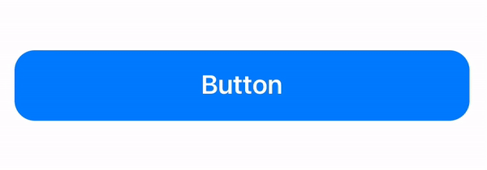

# UI Examples

In this repository, you'll find a collection of small, reusable code snippets that you can freely use and integrate into your own projects. These tiny UI treasures have been carefully crafted, saving you time and effort in your development journey.

## NiceButton

iOS system-style button with scaling down, haptic feedback, and smoothly rounded corners that change in the pressed state. Developed using SwiftUI.

